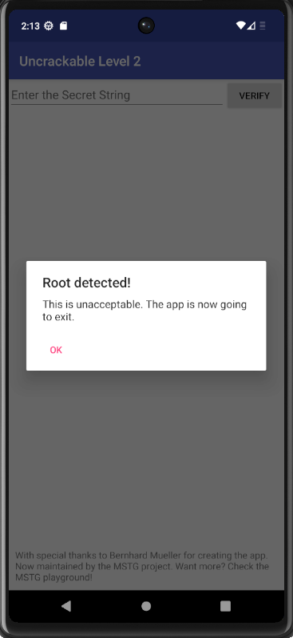
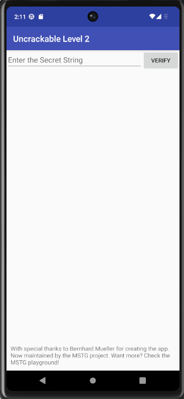
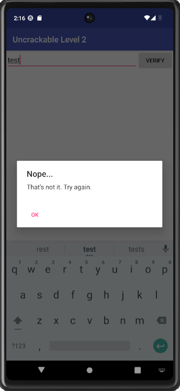
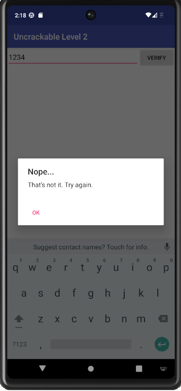
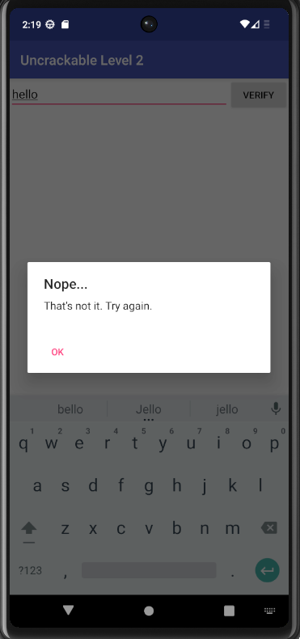
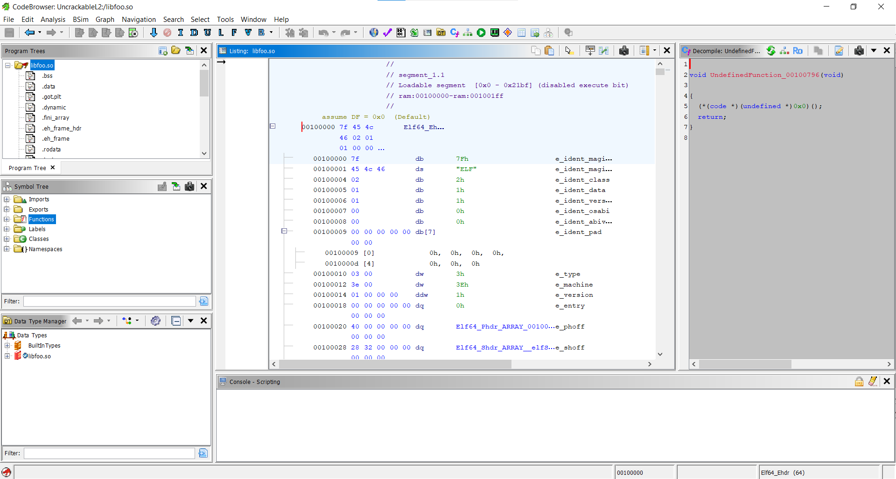
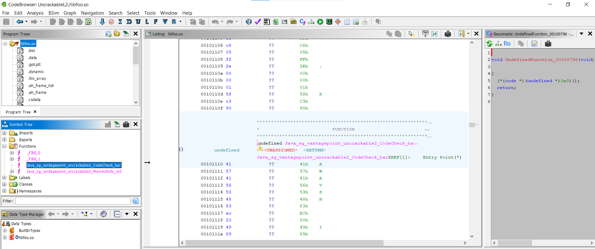
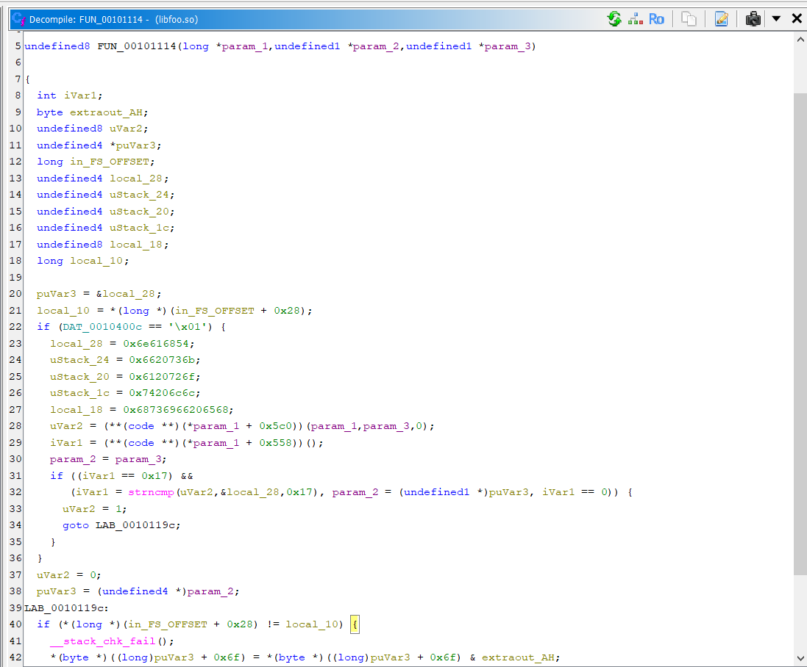
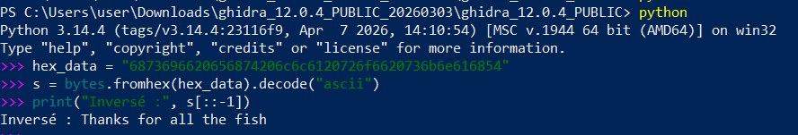
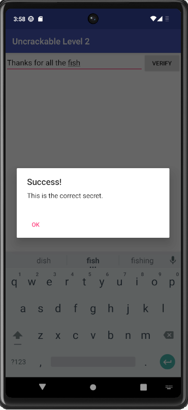

# Lab Analyse Native — OWASP UnCrackable Level 2

**Auteur :** Hiba Sidinou  
**Date :** 04/05/2026  
**APK :** UnCrackable-Level2.apk (OWASP MSTG Crackmes)  
**Outils :** JADX GUI v1.5.5, Ghidra 12.0.4, Frida 16.1.4, Python 3.14  
**Objectif :** Retrouver le secret caché dans une bibliothèque native Android (.so)  
**Secret trouvé :** `Thanks for all the fish`

---

## Flux logique de l'application

```
Utilisateur
   ↓
MainActivity
   ↓
CodeCheck.a(String)
   ↓
CodeCheck.bar(byte[])   ← méthode native
   ↓
libfoo.so
   ↓
strncmp(input, secret)
   ↓
succès / échec
```

---

## Partie 1 — Découverte de l'application

### Étape 1 — Installer et lancer l'APK

**Commandes :**
```powershell
mkdir C:\APK-Analysis-L2
cd C:\APK-Analysis-L2
Copy-Item "C:\Users\user\Downloads\UnCrackable-Level2(1).apk.zip" "C:\APK-Analysis-L2\UnCrackable-Level2.apk"
adb install "C:\APK-Analysis-L2\UnCrackable-Level2.apk"
```

**Résultat :**


L'application affiche une interface simple avec un champ de saisie et un bouton **VERIFY**. Le challenge consiste à trouver la bonne chaîne secrète.

### Étape 2 — Problème : Root détecté !

Au lancement, l'application détecte immédiatement que l'émulateur est rooté et se ferme.



L'application implémente 3 méthodes de détection de root dans la classe `sg.vantagepoint.a.b` :
- `b.a()` → cherche `su` dans le PATH
- `b.b()` → vérifie `Build.TAGS` contient `test-keys`
- `b.c()` → cherche des fichiers su connus (`/system/app/Superuser.apk`, etc.)


### Étape 3 — Bypass du root check avec Frida

Pour contourner la détection, on utilise Frida pour hooker les méthodes de détection et les forcer à retourner `false`.

**Fichier `bypass_root.js` :**
```javascript
Java.perform(function() {
    var rootCheck = Java.use('sg.vantagepoint.a.b');
    rootCheck.a.implementation = function() { 
        console.log('[*] b.a() bypassed!');
        return false; 
    };
    rootCheck.b.implementation = function() { 
        console.log('[*] b.b() bypassed!');
        return false; 
    };
    rootCheck.c.implementation = function() { 
        console.log('[*] b.c() bypassed!');
        return false; 
    };
    console.log('[*] Root check bypassed!');
});
```


**Commande :**
```powershell
frida -U -f owasp.mstg.uncrackable2 -l C:\APK-Analysis-L2\bypass_root.js --no-pause
```


**Résultat — Application accessible après bypass :**



✅ L'application s'ouvre normalement. Le root check est contourné.

---

### Étape 4 — Tester des valeurs incorrectes

On saisit plusieurs valeurs pour confirmer qu'une logique de comparaison existe.







**Observation :** Chaque mauvaise valeur affiche `"That's not it. Try again."` → L'application compare l'entrée à une valeur secrète stockée quelque part.

---

## Partie 2 — Analyse statique avec JADX

### Étape 5 — Analyse de MainActivity

En ouvrant l'APK dans JADX, on identifie les éléments clés de `MainActivity` :

```java
public class MainActivity extends c {
    private CodeCheck m;

    static {
        System.loadLibrary("foo");  // charge libfoo.so
    }

    protected void onCreate(Bundle bundle) {
        init();
        if (b.a() || b.b() || b.c()) {
            a("Root detected!");   // détection root
        }
        if (a.a(getApplicationContext())) {
            a("App is debuggable!");  // détection debug
        }
        this.m = new CodeCheck();
    }

    public void verify(View view) {
        String string = ((EditText) findViewById(R.id.edit_text)).getText().toString();
        if (this.m.a(string)) {
            // Succès
        }
    }
}
```

**Points clés identifiés :**
- `System.loadLibrary("foo")` → charge une bibliothèque native `libfoo.so`
- La vérification passe par `CodeCheck.a()` qui appelle une méthode `native`

### Étape 6 — Classe CodeCheck — La clé du problème


**Conclusion importante :** Le mot-clé `native` signifie que la méthode `bar` n'est **pas implémentée en Java**. Son code se trouve dans `libfoo.so`, compilé en C/C++. Il faut donc analyser la bibliothèque native.

---

## Partie 3 — Extraction de libfoo.so

### Étape 7 — Localiser la bibliothèque native

L'APK contient un dossier `lib/` avec plusieurs architectures :


✅ `libfoo.so` localisé dans `C:\APK-Analysis-L2\lib\x86_64\libfoo.so`

---

## Partie 4 — Analyse native avec Ghidra

### Étape 8 — Importer libfoo.so dans Ghidra

**Commande pour lancer Ghidra :**


**Procédure :**
1. `File → New Project → Non-Shared Project`
2. Nom : `UncrackableL2`
3. `File → Import File → C:\APK-Analysis-L2\lib\x86_64\libfoo.so`
4. Double-clic sur `libfoo.so` → **"Yes"** pour analyser

**Informations du fichier importé :**
```
Program Name  : libfoo.so
Language ID   : x86:LE:64:default (4.6)
Compiler      : gcc
Processor     : x86
Address Size  : 64
ELF File Type : shared object
SHA256        : a7544af921a395f996a6f356187a3a177b983e431bb1a3a66672a215d31ea687
```




### Étape 9 — Trouver la fonction JNI

Les fonctions JNI suivent un schéma de nommage précis :
```
Java_[package]_[classe]_[méthode]
```

Dans le **Symbol Tree** de Ghidra (`Window → Symbol Tree → Functions`), on trouve :

```
Java_sg_vantagepoint_uncrackable2_CodeCheck_bar
```


C'est exactement la version native de `CodeCheck.bar()` !



### Étape 10 — Lire le pseudo-code décompilé

En double-cliquant sur la fonction et en ouvrant `Window → Decompiler` :



**Pseudo-code obtenu :**
```c
undefined8 FUN_00101114(long *param_1, undefined1 *param_2, undefined1 *param_3)
{
  int iVar1;
  undefined4 local_28;
  undefined4 uStack_24;
  undefined4 uStack_20;
  undefined4 uStack_1c;
  undefined8 local_18;

  local_28  = 0x6e616854;      // "nahT" en little-endian
  uStack_24 = 0x6620736b;      // "f sk"
  uStack_20 = 0x6120726f;      // "a ro"
  uStack_1c = 0x74206c6c;      // "t ll"
  local_18  = 0x68736966206568; // "hsif eh"

  iVar1 = strncmp(uVar2, &local_28, 0x17);  // compare input avec le secret
  if (iVar1 == 0) {
      return 1;  // succès
  }
  return 0;  // échec
}
```

**Analyse des valeurs hex :**

| Variable | Valeur hex | ASCII (little-endian) |
|----------|-----------|----------------------|
| local_28 | `0x6e616854` | `nahT` |
| uStack_24 | `0x6620736b` | `f sk` |
| uStack_20 | `0x6120726f` | `a ro` |
| uStack_1c | `0x74206c6c` | `t ll` |
| local_18 | `0x68736966206568` | `hsif eh` |

**Conclusion :** Le secret est stocké en hexadécimal ASCII dans la mémoire de la bibliothèque, et comparé avec `strncmp` sur 23 caractères (`0x17`).

---

## Partie 5 — Décoder le secret

### Étape 11 — Convertir l'hexadécimal en ASCII

```python
hex_data = "6873696620656874206c6c6120726f6620736b6e616854"
s = bytes.fromhex(hex_data).decode("ascii")
print("ASCII brut :", s)
print("Inversé    :", s[::-1])
```

**Résultat :**
```
ASCII brut : hsif eht lla rof sknahT
Inversé    : Thanks for all the fish
```




**Explication :** La chaîne est stockée à l'envers en mémoire (little-endian). En l'inversant, on obtient le secret lisible : **`Thanks for all the fish`**

---

## Partie 6 — Validation du secret

### Étape 12 — Saisir le secret dans l'application

Avec Frida actif (bypass root), on saisit dans l'application :
```
Thanks for all the fish
```



✅ **Challenge résolu !** L'application affiche `"This is the correct secret."`

---

## Synthèse — Vulnérabilités identifiées

| # | Vulnérabilité | Sévérité | Localisation |
|---|--------------|----------|-------------|
| 1 | Secret stocké en mémoire native en clair | 🔴 Élevée | `libfoo.so` — `FUN_00101114` |
| 2 | Comparaison via `strncmp` sans obfuscation | 🔴 Élevée | `libfoo.so` |
| 3 | Détection root contournable via Frida | ⚠️ Moyenne | `sg.vantagepoint.a.b` |
| 4 | Détection debugger contournable | ⚠️ Moyenne | `MainActivity` — `AsyncTask` |
| 5 | `allowBackup="true"` dans le manifeste | ⚠️ Moyenne | `AndroidManifest.xml` |

### Remédiations recommandées

1. **Ne jamais stocker de secrets en clair** dans le code natif — utiliser un serveur d'authentification
2. **Obfusquer le code natif** avec des outils comme LLVM-Obfuscator
3. **Utiliser Google Play Integrity API** pour une détection de root plus robuste
4. **Implémenter une vérification d'intégrité** de la bibliothèque `.so` au runtime
5. **Désactiver `allowBackup`** en production

---

## Outils utilisés

| Outil | Version | Rôle |
|-------|---------|------|
| JADX GUI | 1.5.5 | Décompilation Java de l'APK |
| Ghidra | 12.0.4 | Analyse de la bibliothèque native libfoo.so |
| Frida | 16.1.4 | Bypass dynamique de la détection root |
| Python | 3.14 | Décodage hexadécimal et inversion de chaîne |
| ADB | 1.0.41 | Installation et communication avec l'émulateur |

---

## Ressources

- OWASP MSTG Crackmes : https://mas.owasp.org/crackmes/
- OWASP MASTG — Native Code : https://mas.owasp.org/MASTG/
- Ghidra : https://ghidra-sre.org/
- Frida : https://frida.re/docs/home/
- JNI Naming Convention : https://docs.oracle.com/javase/8/docs/technotes/guides/jni/

---

*Analyse réalisée dans un cadre pédagogique — APK OWASP Crackme — données fictives*
